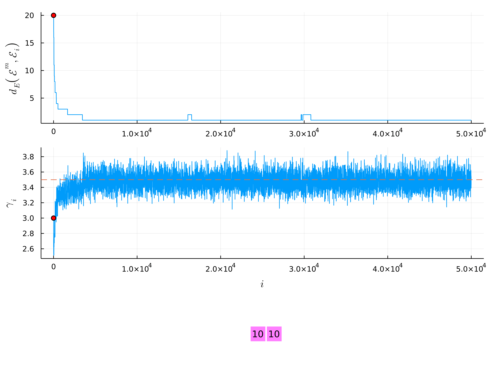
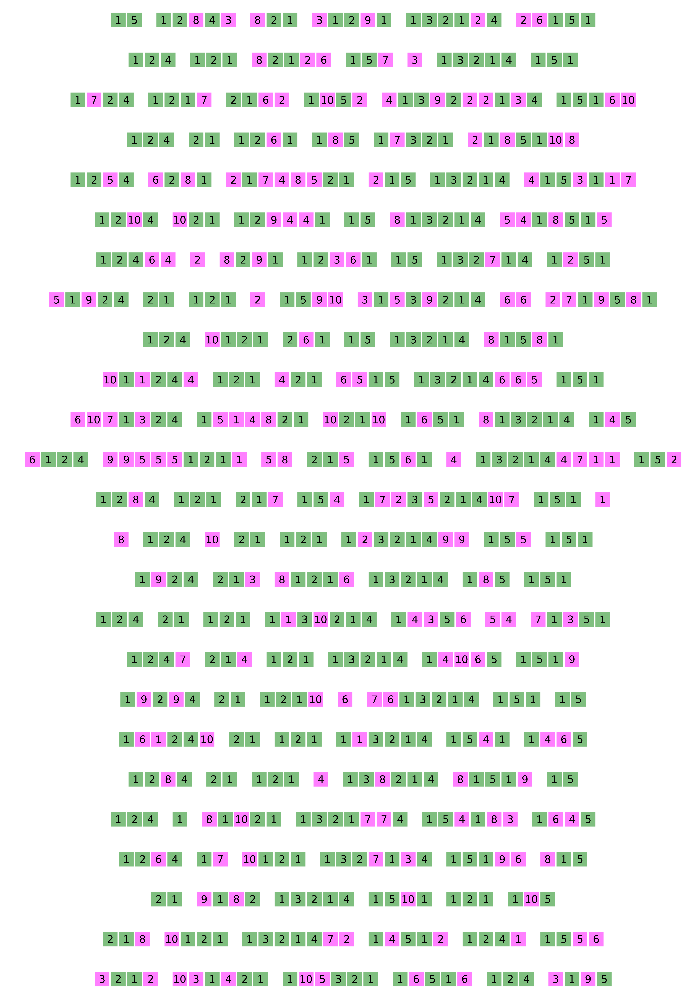

### Supplement - Modelling Populations of Path-observed Networks - ISBA World Meeting 2022

*George Bolt - g.bolt@lancaster.ac.uk - https://lancaster.ac.uk/~boltg/*

* Animation shows multiset of paths corresponding to marker on traceplots (big gaps separate distinct paths);
* Green entries are common with mode, whilst magenta entries highlight errors;
* Simulation parameters
    * $\mathcal{E}^m$ = \{(1,2,1), (1,3,2,1,4), (1,2,4), (1,5,1), (1,5), (2,1)\} (mode)
    * $\gamma=3.5$ (dispersion)
    * $n=25$ (sample size)
    * $d_E(\cdot, \cdot)$ taken as matching distance (defined on posterior), with distance between paths based upon common subsequences
* Initialised MCMC chain at $\mathcal{E}_0 = \{(10,10)\}$ and $\gamma_0=3.0$.

#### Data 

* Below is the $n=25$ observations $\{\mathcal{E}^{(i)}\}_{i=1}^n$ used in this simulated example, drawn from an $\text{SIM}(\mathcal{E}^m, \gamma)$ model (approximately via MCMC algorithm);
* Green entries are common with the mode $\mathcal{E}^m$, whilst pink entries highlight errors.

