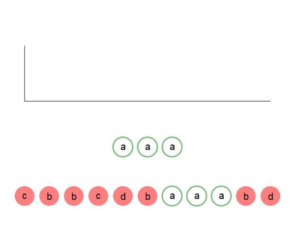

<!-- _class: lead-->

# Testing File for `my-theme-dev`

---

# Standard Slide

---
<!-- _class: invert-->
# Lists

---

---
<!-- _class: left-->
# Lists for `left` Class

This is a test line to see how the content fits on the page. This should be long enough to wrap so we can see what happens when we get to the end

* This will happen when write lists 
  * This will 
* Ul2
  1. thth 

1. This sus s same 

---
<!-- _class: left_clist-->
# Lists for `left_clist` Class

This is a test line to see how the content fits on the page. This should be long enough to wrap so we can see what happens when we get to the end

* This will happen when write lists 
  * This will 
* Ul2
  1. thth 

1. This sus s same 

---
# Centered List
This is what we get on the standard setting (everything centered)
1. ththt
    1. tjtjt  
    2. thhtht

---
<!-- _class: left_clist-->
# Images

We can add the keyword `center` to `` to center the image

